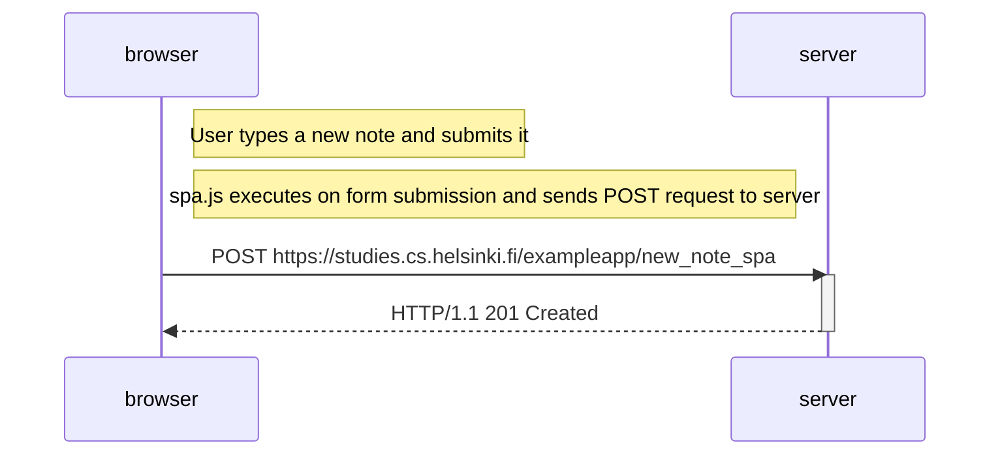

```mermaid
sequenceDiagram
    participant browser
    participant server

    Note right of browser: User types a new note and submits it 
    Note right of browser: spa.js executes on form submission and sends POST request to server

    browser->>server: POST https://studies.cs.helsinki.fi/exampleapp/new_note_spa
    activate server
    server-->>browser: HTTP/1.1 201 Created
    deactivate server
```